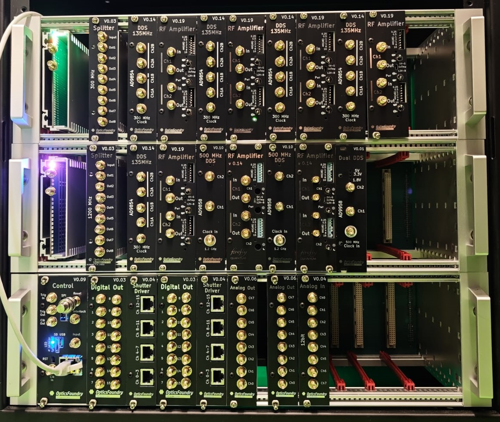

# Introduction

This repository contains _OpticsFoundry_ControlLight_, a simple API for OpticsFoundry's control system, available as code for Visual Studio, as DLL for Qt, Visual Studio and as library for Python.

The library code is contained under [ControlLight](https://github.com/opticsfoundry/OpticsFoundry_ControlLight/tree/main/ControlLight).

The other folders contain example programs using various interfaces to the library.


## Overview


OpticsFoudry's control system can be accessed through three types of software:


1. **ControlLightAPI**  
    A simple API giving the most direct access to the hardware. Tested with Python, Visual Studio C++ and Qt Creator (with MinGW). This is the version contained in this repository.

2. **ControlAPI**  
    A fully featured API, see [OpticsFoundry_Control](https://github.com/opticsfoundry/OpticsFoundry_Control), having functions such as complex sequence assembly with "GoBackInTime", "Wavefunctions", and sequence cycling with individual command updates in the background. This is for example used for the [AQuRA clock](https://www.aquraclock.eu/).  
    This API's DLL has been tested with Visual Studio C++ and Qt Creator (with MinGW, see repository [OpticsFoundry_Control_Qt](https://github.com/opticsfoundry/OpticsFoundry_Control_Qt)). The API can also be accessed through TCP/IP, and we provide a Python and a Qt Creator example for that.  
    
3. **Control.exe**  
    This is a fully featured experiment control system, based on ControlAPI, see [OpticsFoundry_Control](https://github.com/opticsfoundry/OpticsFoundry_Control). Control.exe can be configured through code and/or through configuration files (the latter in the same manner as ControlAPI, on which Control.exe is based).

&nbsp;

## OptiscFoundry control electronics

You can order the OpticsFoundry control electronics from [OpticsFoundry](https://www.opticsfoundry.com/).

 

&nbsp;

## Getting started

The best starting point is to study one of the simple example programs and I recommend starting with [ControlLight/ControlLight.cpp](ControlLight/ControlLight.cpp). In main() of that file, select one of the demo programs after the other, run them, step through them and read the explanatory comments in the code. To run them, you will need to adjust the IP address of your FPGA Sequencer, which is best done by editing the IP in [ConfigFileCreators/ControlHardwareConfigFileCreator.py](ControlLight/ConfigFileCreators/ControlHardwareConfigFileCreator.py) and running that script, or quick-and-dirty by typing the IP into ControlHardwareConfig.json under the entry "IP". Make also sure to correctly specify the clock frequency of each DDS that you use in that config file. Execute ControlHardwareConfigFileCreator.py to recreate the .json config file.


&nbsp;

## ControlLightAPI interface

For convenience, here the easy to read Python test code [ControlLight_DLL_Test_Python/ControlLight_Test.py](ControlLight_DLL_Test_Python/ControlLight_Test.py):


```py
import sys

main_path = ""
library_path = "lib"
sys.path.append(library_path)

import control_light_api

cla = control_light_api.ControlLightAPI()

print("Created:", cla.is_created())
try:
   cla.configure(display_errors = False)
   cla.load_from_json_file(main_path+r"ControlHardwareConfig.json")
except Exception as e:
   print("Error loading JSON file:", e)
   sys.exit(1)
try:
   cla.initialize()
   cla.switch_debug_mode(True, "DebugSequence")
   start_time = 0
   for i in range(10):
       cla.start_assembling_sequence()
       cla.sequencer_start_analog_in_acquisition(0, 0, 0, 0, 100, 0.1)
       for j in range(100):
           cla.set_voltage(0, 24, 10.0 \* j / 100.0)
           cla.wait_ms(0.1)
           frequency = 1000.0 \* j / 100.0
           cla.set_frequency(0, 232, frequency)
       cla.execute_sequence()
       input = cla.wait_till_end_of_sequence_then_get_input_data(timeout_in_s = 10)
       print("Input data length:", input\["length"\]," duration:", input\["end_time_of_cycle"\]-start_time)
       start_time = input\["end_time_of_cycle"\]

except Exception as e:
   print("Error:", e)
   sys.exit(1)
```

The API interface is documented in  
_ControlLight_docs\\html\\index.html_
and therein in -> Files -> ControlAPI.h  
(This document is created from the docstrings in ControlAPI.h using [Doxygen](https://doxygen.nl/). To obtain the latest version of the documentation, read the docstrings in ControlAPI.h directly, or load the Doxyfile in Control_Light_docs into Doxywizard and recompile.)
For convenience here the relevant part of the [documentation](ControlLight_docs/ControlLight_API_Documentation.pdf).  

A good way to learn how the API works is to use the EXE mode in the ControlLight in Visual Studio 2022 in Debug mode. Then you can step through the example.  

Please note that all the Python command names are converted into lower case snake names, e.g.  
_cla.load_from_json_file(main_path+r"ControlHardwareConfig.json")_  
instead of _LoadFromJSONFile()_. The details are in the binding description in  
_ControlLight\\bindings\\ControlAPI_Python.cpp_

&nbsp;

## ControlLightAPI hardware configuration JSON file

The hardware configuration file _ControlHardwareConfig.json_ contains lists of devices connected to the control system. This hardware configuration file is created by running the Python script  
_.\\ConfigFileCreators\\ControlHardwareConfigFileCreator.py_  
(Here . designates the control source code directory.)

If you want to read the json file, use an editor that understands json syntax, e.g. Visual Studio Code. I recommend regenerating the json file using the Python script, not manually editing it.  

Here an example Python hardware configuration file generator script:  

```py
if __name__ == "__main__":
   builder = ConfigBuilder()
   builder.RegisterSequencer(IP="192.168.0.109", Port=7, ClockFrequency=100000000, BusFrequency=2000000, DebugOn = False)
   analog_out_configs = [
       (24, False, 0, 10),
       (28, True, -10, 10),
       (32, True, 0, 10),
       (36, True, -10, 10),
       (40, True, -10, 10)
   ]
   for addr, signed, minv, maxv in analog_out_configs:
       builder.RegisterAnalogOutBoard16bit(StartAddress=addr, Signed=signed, MinVoltage=minv, MaxVoltage=maxv)
   for addr in [1, 2, 3, 4, 5, 6]:
       builder.RegisterDigitalOutBoard(Address=addr)
   for addr in range(132, 172, 4):
       builder.RegisterDDSAD9854Board(Address=addr)
   for addr in range(52, 84, 4):
       builder.RegisterDDSAD9858Board(Address=addr)
   builder.RegisterDDSAD9959Board(Address=21)
   builder.Save()
```

&nbsp;

## Use with labscript

We are working on a labscript interface. Please contact us if you are interested in it, as we can accelerate its development if there is interest.

&nbsp;

## Use with Linux and Windows

ControlLight works with Linux and Windows, thanks to Jérôme Lodewyck rendering the code portable.

&nbsp;

## Rebuilding and using ControlLightAPI

The ControlLight API code resides in the folder "ControlLight", which is a Visual Studio C++ 2022 CMake project.  

This API can be used in several ways:  
1. Use it in Python, see example ControlLight_DLL_Test_Python.  
2. Use it in Visual Studio, see example ControlLight_DLL_Test_VS_console.  
3. Use it in Qt Creator MinGW, see examples ControlLight_DLL_Test_Qt_console and ControlLight_DLL_Test_Qt_GUI.  
4. Compile it directly into your code. The examples are given directly in the ControlLight project, in the file ControlLight.cpp, and can be accessed by switching the project settings to EXE in the CMakeLists.txt file.  

You can also modify the API and recreated the DLL, LIB, PYD files as needed for VS, Qt, Python. For this you need to edit the code in the folder "ControlLight".  

Each of the examples do need access to a hardware configuration file. The path and filename is set in the LoadFromJSONFile() function in C or the cla.load_from_json_file() function in Python. In the demos it’s the ControlHardwareConfig.json file. The structure of this file is explained in the "Hardware configuration file" section below.  

If you need/want to update the library, then do either A) use cmake from the CLI or B) use Visual Studio and follow the manual steps outlined below. 


&nbsp;

### **A) cmake from CLI**

The build mode can be selected from the CMake command line, so the CMakeLists.txt file does not need to be edited for normal rebuilds:

```bat
cmake -S ControlLight -B ControlLight\out\build\x64-release -DBUILD_MODE=PYD
cmake --build ControlLight\out\build\x64-release --config Release
```

Use `-DBUILD_MODE=DLL` for the C/Qt/Visual Studio DLL and `-DBUILD_MODE=EXE` for the direct executable test mode.

To also copy the generated artifacts into the example project folders, add:

```bat
-DCONTROL_LIGHT_STAGE_EXAMPLES=ON
```

The Qt Creator output folders depend on the installed Qt version and kit name. To copy the DLL there as well, also add `-DCONTROL_LIGHT_STAGE_QT_EXAMPLES=ON` and adjust the `CONTROL_LIGHT_QT_*_DIR` CMake cache paths if your Qt Creator build folder names differ.

### Rebuilding for Python

Configure and build the Python module:

```bat
cmake -S ControlLight -B ControlLight\out\build\x64-release -DBUILD_MODE=PYD -DCONTROL_LIGHT_STAGE_EXAMPLES=ON
cmake --build ControlLight\out\build\x64-release --config Release
```

With `CONTROL_LIGHT_STAGE_EXAMPLES=ON`, CMake copies the generated `control_light_api*.pyd` and `ControlLight.dll` into _ControlLight_DLL_Test_Python\\lib_. It also copies them into _ControlLight_DLL_Test_Python_for_pip\\control_light_api_ and renames the pyd file to _\__init_\_.pyd_ for the pip package.

Installing the control_light_api systemwide using pip:  
After rebuilding with staging enabled, open a console, change to the _ControlLight_DLL_Test_Python_for_pip_ folder, and run  
_pip install ._    
Uninstalling a pip installed control_light_api: run  
_pip uninstall control_light_api_  

### Rebuilding for Visual Studio

Configure and build the DLL:

```bat
cmake -S ControlLight -B ControlLight\out\build\x64-release -DBUILD_MODE=DLL -DCONTROL_LIGHT_STAGE_EXAMPLES=ON
cmake --build ControlLight\out\build\x64-release --config Release
```

The Debug configuration uses the same command structure with an x64-debug build folder and `--config Debug`. The release version is significantly faster, but does not provide Visual Studio debug information.

With `CONTROL_LIGHT_STAGE_EXAMPLES=ON`, CMake copies _ControlLight.dll_ to _ControlLight_DLL_Test_VS_console\\bin_ and _ControlLight.lib_ to _ControlLight_DLL_Test_VS_console\\lib_. The in-repository Visual Studio test project includes _ControlLight\\ControlAPI.h_ directly, so no header copy is needed for that example.

### Rebuilding for Qt Creator (MinGW C++)  
   
Recreate the DLL in x64 release or debug mode as described above. Qt Creator build output paths include the Qt version and kit name, so check the `CONTROL_LIGHT_QT_*_DIR` CMake cache paths before enabling Qt staging:

```bat
cmake -S ControlLight -B ControlLight\out\build\x64-release -DBUILD_MODE=DLL -DCONTROL_LIGHT_STAGE_EXAMPLES=ON -DCONTROL_LIGHT_STAGE_QT_EXAMPLES=ON
cmake --build ControlLight\out\build\x64-release --config Release
```

When Qt staging is enabled, CMake copies _ControlLight.dll_ into the configured Qt console and GUI release/debug build folders.


&nbsp;


### **B) Rebuild using Visual Studio and manual file copy**

Manually building the API (an older way of creating it) is still possible and kept for the moment as fallback. However, `BUILD_MODE` is now a CMake cache variable. If Visual Studio has already configured the project once, changing the default `BUILD_MODE` line in CMakeLists.txt may not be enough, because the old value can remain stored in the build folder's CMake cache.

If Visual Studio keeps building the previous mode, use one of these methods:

1. In Visual Studio, open **Project -> Delete Cache and Reconfigure** for the CMake project, then let Visual Studio configure again.
2. Or close Visual Studio and delete the relevant build folder, for example _ControlLight\\out\\build\\x64-release_ or _ControlLight\\out\\build\\x64-debug_. Reopen the project and let Visual Studio configure again.
3. Or delete only the _CMakeCache.txt_ file inside the relevant build folder, then reconfigure.

After clearing the cache, Visual Studio will read the current default `BUILD_MODE` from CMakeLists.txt again. As an alternative, set `BUILD_MODE` directly in Visual Studio's CMake cache/settings UI to `EXE`, `DLL`, or `PYD`.


### Rebuilding for Python

\- In the ControlLight Visual Studio project, in CMakeLists.txt, choose the configuration PYD at the location marked with _"<-- change this line to switch build…"_.  
\- Safe the CMakeLists.txt file, which automatically will launch CMake and reconfigure Visual Studio.   
\- For safety, use Build -> Clean All.  
\- Build as x64 Release.  
\- Copy the files  
_control_light_api.cp310-win_amd64.pyd_  
_ControlLight.dll_  
from _ControlLight\\out\\build\\x64-release to ControlLight_DLL_Test_Python\\lib_  

Installing the control_light_api systemwide using pip:  
Put the new pyd and dll into the _ControlLight_DLL_Test_Python_for_pip\\control_light_api_ folder, rename the pyd file into _\__init_\_.pyd_, open a console, change to the _ControlLight_DLL_Test_Python_for_pip_ folder, and run  
_pip install ._    
Uninstalling a pip installed control_light_api: run  
_pip uninstall control_light_api_  

### Rebuilding for Visual Studio

\- In the ControlLight Visual Studio project, in CMakeLists.txt, choose the configuration DLL at the location marked with _"<-- change this line to switch build…"_.  
For the specific example given, check that the settings in the  
_elseif(BUILD_MODE STREQUAL "DLL")_  
branch are still  
_target_compile_definitions(ControlLight PRIVATE BUILDING_DLL)_  
_target_compile_definitions(ControlLight PRIVATE C_API)_  
_target_compile_definitions(ControlLight PRIVATE \_AFXDLL)_  
(note that the definition of API_CLASS is commented out).

\- Safe the CMakeLists.txt file, which automatically will launch CMake and reconfigure Visual Studio.  
\- For safety, use Build -> Clean All.  
\- Build as "x64 Debug" or "x64 Release". The release version is significantly faster, but doesn't provide Visual Studio debug information.  
\- Copy the file  
_ControlAPI.h_
from _ControlLight_ to _ControlLight_DLL_Test_VS_console\\include_ and rename it to  
_ControlLight.h_  

Copy the files  
_ControlLight.lib_  
_ControlLight.dll_  

for "x64 Debug":  
from _ControlLight\\out\\build\\x64-debug_ to _ControlLight_DLL_Test_VS_console\\lib_ and _ControlLight_DLL_Test_VS_console\\bin_, respectively.  

for "x64 Release":  
from _ControlLight\\out\\build\\x64-release_ to _ControlLight_DLL_Test_VS_console\\lib_ and _ControlLight_DLL_Test_VS_console\\bin_, respectively.  

### Rebuilding for Qt Creator (MinGW C++)  
   
\- Recreate the DLL with Visual Studio in x64 release or debug mode (see above).  

For release version:  
Copy the ControlLight.dll file from _ControlLight\\out\\build\\x64-release_ to  
_ControlLight_DLL_Test_Qt_console\\build\\Desktop_Qt_6_7_2_MinGW_64_bit-Release\\release_  
and  
_ControlLight_DLL_Test_Qt_GUI\\build\\Desktop_Qt_6_7_2_MinGW_64_bit-Release\\release_  

For debug version:  
Copy the _ControlLight.dll_ file from _ControlLight\\out\\build\\x64-debug_ to  
_ControlLight_DLL_Test_Qt_console\\build\\Desktop_Qt_6_7_2_MinGW_64_bit-Debug\\debug_   
and  
_ControlLight_DLL_Test_Qt_GUI\\build\\Desktop_Qt_6_7_2_MinGW_64_bit-Debug\\debug_  


&nbsp;

## Basic structure of ControlLightAPI

Each device is described in a class CDevice… derived from CDevice.  
The sequencer is also such a device, but with a somewhat special status, as it communicates with the control program over TCP/IP and sends signals to the devices attached to the FPGA sequencer over parallel bus or SPI.  

When the hardware configuration json file is read, the sequencers and their attached devices are defined, each as an instance of its class.
The sequencers contain a list of all possible addresses, containing pointers to these instances. The pointers are nullptr if nothing is connected.  

Commands are assembled into a sequence, which is sent to the FPGA sequencer over TCP/IP and then executed. Acquired data (e.g. from ADCs) is returned to the PC over TCP/IP after the sequence ends.

During sequence assembly, when a command is sent to a device that is attached to a sequencer with a certain id on a certain address, the software looks up the pointer to the instance of CDevice (or derived class) that exists under that sequencer id and address. 

If nullptr is obtained an error is registered. If a valid pointer is obtained, the command is sent to the device. If the device is of the correct type, it will be able to handle the command. However, if the user confused an address, and sends a, let's say, SetVoltage command to a DDS, there is a problem. The CDeviceDDS class doesn't contain a SetVoltage command. Therefore the base classes SetVoltage command is called, i.e. CDevice::SetVoltage. All CDevice command functions are abstract, they just register an error. This means we use the C++ virtual function programing style to check if the commands sent by the user are ok.

What does "registering an error" do?  
If the user has called _cla.configure(True)_ an error message will be shown.  
If Python is used or a C++ DLL compiled with _#define THROW_EXCEPTIONS_, then a _CLA_Exception_ will be thrown.  
If none of the above, the error message will be added to a list of error messages and a flag will be set showing that an error occurred. 
The user of the API can use _DidErrorOccur()_ to querry if one occurred. If one or more occurred, GetLastError will return up to the ten last error messages as one string.

&nbsp;

## Sequencer firmware

The sequencer firmware compatible with this software is [OF_Sequencer_Zturn](https://github.com/opticsfoundry/OF_Sequencer_Zturn) and uses the Z-turn board V2. Follow the instructions in that repository to update your firmware.

